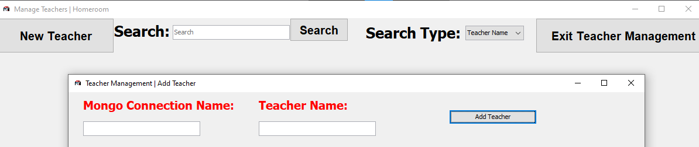

---
hide:
  - footer
title: "📚 Reference"  
---

# Administrator Reference
This page contains a minor overview over every feature within Homeroom that administrative users are able to use. This page should be over at least once before using Homeroom, to ensure that users are familiar with what they will see when beginning to work with Homeroom.

## [Configure Homeroom](configureHomeroom.md)
Homeroom can be configured using the following GUI, which will allow you to change key values and data, such as teaching staff.

!!! warning "This feature is incomplete!"

    Homeroom is not a finished project. As such, this feature is very incomplete, and is currently nothing more than a placeholder for more features to come. These will be implementee as soon as possible, but in the mean time, try [contributing your own features.](../contributors.md)

[Go to Homeroom Configuration :material-code-tags:](configureHomeroom.md){.md-button .md-button--primary}

## [Teacher Management](teacherManagement.md)
Teacher Management is used to create, view, delete and edit Teacher information. These Teachers can then be used throughout the application and your institution.

For examples, they could be added to a Class and a Form, and be given guardianship over those classes. They can then also take lessons, registers and perform administrative tasks.

!!! info "Teacher Management"

    View, Edit, Add and Delete Teachers from this menu. Any new information added to this menu should be refreshed when initiating another search.

[Go to Teacher Management :teacher:](teacherManagement.md){.md-button .md-button--primary}