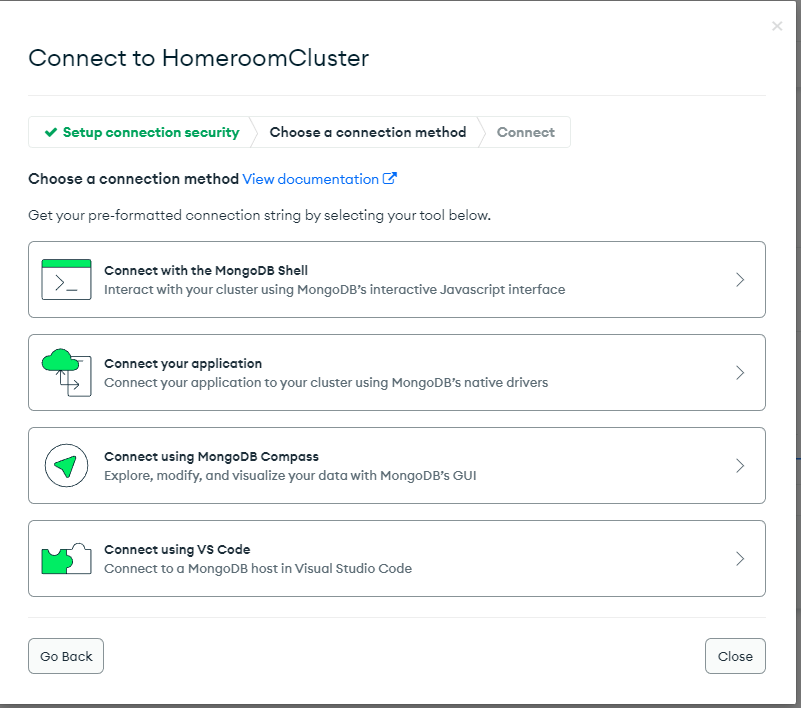
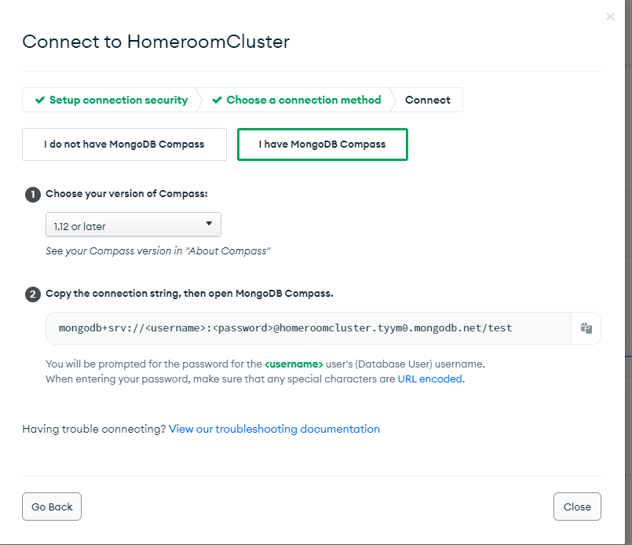
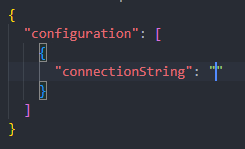
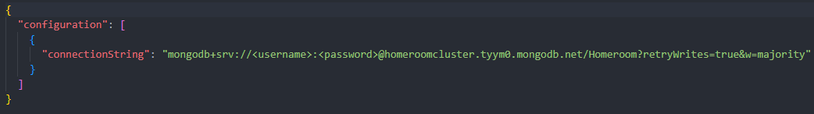

---
hide:
  - footer
title: "⚙️ Setup"  
---

# Homeroom Configuration
Homeroom can be configured using the following GUI, which will allow your to change key values and data, such as teaching staff and generation settings.

!!! warning "This feature is incomplete!"

    Homeroom is not a finished project. As such, this feature is very incomplete, and is currently nothing more than a placeholder for more features to come. These will be implementee as soon as possible, but in the mean time, try [contributing your own features.](../contributors.md)

## Setup
Below are the steps a user will need to take to get Homeroom installed on a computer and running. It is likely that administrators will be able to rapidify this process by simultaenously running these steps on all relevant devices.

1\. First, [create a new MongoDB cluster.](https://www.mongodb.com/basics/clusters/mongodb-cluster-setup) This will be your database instance for Homeroom.
2\. [Download and run Homeroom.](https://github.com/longbow122/Homeroom/releases) You can download it from the [linked releases page.](https://github.com/longbow122/Homeroom/releases)
3\. Once you have done this, Homeroom will fail the first time, generating an empty configuration file for you to use. Then, move onto your MongoDB instance. Click the "Connect" button.

???+ info "Your MongoDB Cluster"

    You should see the following menu when you do so. Continue to follow the steps from here.

4\. Click on "Connect using MongoDB Compass". This will show you your connection string, which you will pass into the `config.json` of Homeroom.

5\. Copy the string shown in "Step 2", and open your generated config.json file for Homeroom. It should look like the following:

6\. Then, paste this string in-between the quote marks within the key `connectionString`, and save the file. There is no need to replace anything within the string. Simply pass the string in as shown below to allow for universal logins. Your file should now look like the following:

???+ danger "Paste EVERYTHING YOU COPIED!"

    Ensure that you pasted everything you copied from the connection string. If you missed anything when copying, or didn't paste the right string, Homeroom will fail to connect!

7\. You can now start to create sub-users, who will be able to access Homeroom from their devices. First, [add database users to your cluster.](https://www.mongodb.com/docs/atlas/tutorial/create-mongodb-user-for-cluster/)

8\. Run Homeroom. Homeroom should now successfully launch, taking a while to launch the first time while it writes in the needed information and databases for your institution. 

9\. Should you choose to do so, you can now [add Teachers to your database,](https://longbow122.github.io/homeroom-docs/adminDocumentation/teacherManagement/#add-teacher) using the mongodb connection names you created in step 7.

10\. Homeroom has now been setup! Enjoy!