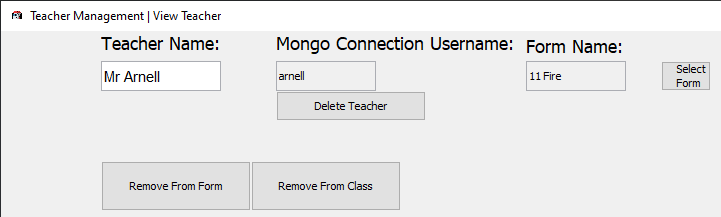
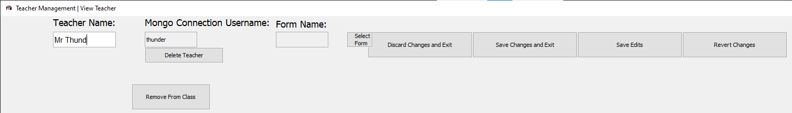
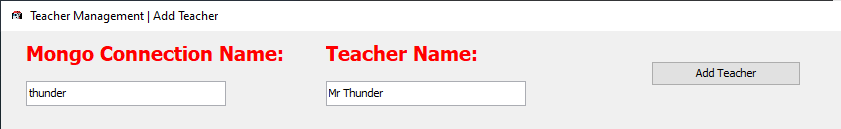
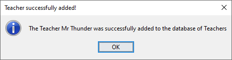
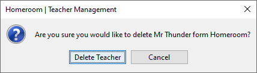
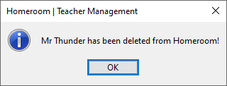

---
hide:
  - footer
title: "👨‍🏫 Teacher Management"  
---

# Teacher Management
This page contains a detailed description of every feature within Teacher Management that admins and normal sub-users are able to use.

Homeroom features are powerful Teacher Management system that is able to handle data at a large, and detailed scale.

???+ info "The Interface for Teacher Management"

    This menu shows the core functions of Teacher Management, ranging from viewing teacher information, adding teachers, deleting teachers and editing teacher information.

## View Teacher
Use the search bar to search for specific teachers, making use of several search filters to improve the accuracy of your search.

Left-Click your search result teacher, to view their information. Depending on the level of permissions you hold, you can also delete, or edit the Teacher's information within the same window.

???+ warning "Check your permissions!"

    Normal sub-users will not be allowed to access this GUI. If you find yourself struggling to access this menu, check Homeroom's main menu to see your level of permissions, or ask your administrator.

!!! info "Information"

    View Teacher Information from both administrative and normal accounts. Note that editing and deletion of data can only be done through an administrative account.

## Edit Teacher
Use Teacher Management's "View Teacher" menu to edit Teacher Information as an administrator.

Left-Click a search result, and edit Teacher information within the menu with ease. Once you are done editing Teacher information, simply click one of the "Save" buttons to save your information.

## Add Teacher
Use the Teacher Management menu to add Teacher Information as an administrator. Make use of the "Add Teacher" menu to add Teacher information.

??+ info "Add Your Teachers here!"

    Fill in all required fields highlighted in red, and any block, optional fields. Then, click the "Add Teacher" button to add the Teacher to Homeroom's database.

## Delete Teacher
Use Teacher Management's "View Teacher" menu to delete Teacher Information as an administrator.

Left-Click a search result, and use the "Delete Teacher" button to delete Teacher Information. You will be asked for confirmation before you do this.

???+ danger "Careful!"

    Ensure that you delete the right Teachers. You will NOT be able to recover any data you delete!

