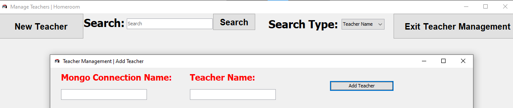
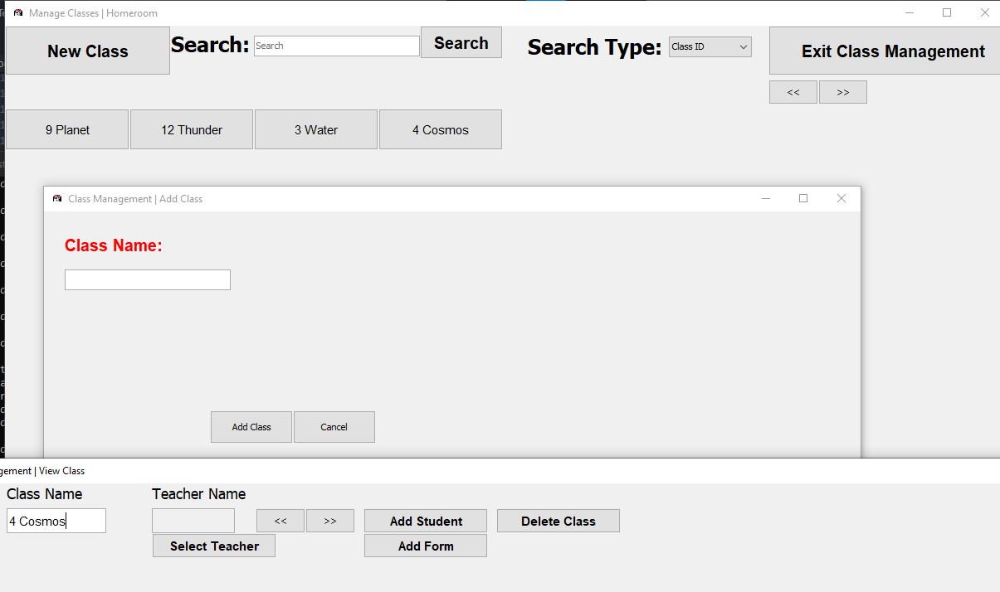

---
hide:
  - footer
title: "✨ Features"  
---

#  Feature List
<ins>**This page is unfinished and only showcases some of our features.</ins>**

**Detailed documentation for each feature can be found in the [User Documentation](userDocumentation/userHome.md) tab.**

## Cloud-Based
Never worry about losing a file again with a structured, cloud-based application using [MongoDB](https://www.mongodb.com/cloud/atlas/register). Download Homeroom on any machine, and continue right where you left off.

{ align=left }
!!! info "Don't waste time manually sending information to an Admin."

    Thanks to Homeroom and [MongoDB](https://www.mongodb.com/cloud/atlas/register), you'll never need to worry about sending information to an Admin again. Simply perform your task through Homeroom as standard, and let Homeroom handle the rest.

## Per-User Permissions
Using [MongoDB](https://www.mongodb.com/cloud/atlas/register)'s built-in permissions system, Homeroom is able to use this information to gauge what each user is able to do, and hide certain features and information from the user according to their specific permissions.

!!! info "Hold individual permissions for each user, ensuring that no malicious changes are made accidentally."

    Thanks to Homeroom and [MongoDB](https://www.mongodb.com/cloud/atlas/register), you can ensure that nobody views information they're not meant to see, and ensure that nobody modifies information they're not meant to be modifying.

!!! info ""

    Each user will hold pre-defined permissions that you can specify. Depending on the level of permissions the user holds, the more, or less they can see and edit.

## Staff Management
Manage your Administrative and Teaching staff efficiently through Homeroom. Create their account information entirely through the desktop client, meaning that everything is kept simple and out-of-the-box.

!!! info "Manage your Staff easily with Teacher Management"

    Add the information of your Homeroom sub-users within this GUI, and give them access to your institutions data for viewing and management. Depending on the level of permissions, you can ensure that nobody views information they're not meant to see, and ensure that nobody modifies information they're not meant to be modifying.

## Student Management
Manage each and every Student with ease through Homeroom. Add your Student to Homeroom's database, and view, modify and use their information throughout their time within your insititutions in Form Groups, Classes and more.

!!! info "Manage your Students with ease using Student Management"

    Add the information of your Students within this GUI, and add them to Classes, Form Groups, take registers with them, account for their attendance, modify and view their schedules and more.
## Class Management
Manage Classes with ease using Class Management. Add Students and Teachers to your Classes before adding them to a schedule. Use this class throughout the institution in performing several administrative operations.

!!! info "Manage your Classes easily with Class Management"

    Manage every Class within your institution through Homeroom. Create a Class and add Forms, Students and Teachers to it. Use this Class within your institution to perform several administrative tasks while managing the school.

## Form Management
Manage every Form within your institution through Homeroom. Create a Form and add Students to it. Use this Form throughout your institution to perform several administrative tasks while managing the school.

!!! info "Manage your Forms with ease using Form Management"
    
    Create Forms using this GUI, and add them to Classes, or even outright use them within your institution's schedule.

## Class Scheduling
This feature has not been documentated yet due to it not being fully developed. The appropriate space has been left for this feature within documentation. Please see the [contributors page :fontawesome-solid-file-code:](contributors.md) to aid in the development of this feature.

## Register Management and Taking
This feature has not been documentated yet due to it not being fully developed. The appropriate space has been left for this feature within documentation. Please see the [contributors page :fontawesome-solid-file-code:](contributors.md) to aid in the development of this feature.
## Administrator Notifications
This feature has not been documentated yet due to it not being fully developed. The appropriate space has been left for this feature within documentation. Please see the [contributors page :fontawesome-solid-file-code:](contributors.md) to aid in the development of this feature.