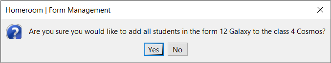

---
hide:
  - footer
title: "👨‍🏫 Class Management"  
---

# Class Management
This page contains a detailed description of every feature within Class Management that administrative and normal sub-users are able to use.

Homeroom features a powerful Class Management system that is able to handle data at a large, and detailed scale.

???+ info "The Interface for Class Management"

    This menu shows the core functions of Class Management, ranging from viewing class information, adding classes, deleting classes and editing class information.

## View Class
Use the search bar to search for specific classes, making use of several search filters to improve the accuracy of your search.

Left-Click your search result class, to view their information. Depending on the level of permissions you hold, you can also delete, or edit the Class's information within this same window.

???+ warning "Check your Permissions!"

    If you are a normal sub-user, you will not be able to edit, or delete Class Information. Ensure that you check Homeroom's main menu to see your level of permissions, or ask your administrator. 

!!! info "Information"

    View Class Information from both administrative and normal accounts. Note that editing and deletion of data can only be done through an administrative account.

## Edit Class
Use Class Management's "View Class" menu to edit Class Information as an administrator.

Left-Click a search result, and edit Class information within the menu with ease. Once you are done editing Class information, simply click one of the "Save" buttons to save your information.

???+ warning "Check your Permissions!"

    If you are a normal sub-user, you will not be able to edit, or delete Class Information. Ensure you check Homeroom's main menu to see your level of permissions, or ask your administrator.

It is also worth noting that Class Management behaves somewhat differently, in the sense that most of Class Management is handled with different menus. The usage for these is documented below.

### Add Teacher to Class
You are able to add a specific Teacher to your Form by clicking the "Add Teacher" button. You can then make use of the "Search and Select Teachers" menu to search for a specific Teacher, and have them take over that Class.

???+ info "Add your Teacher here!"

    Select your Teacher and add them to the Class!

### Add Student to Class
You are able to add a specific Student to your Class by clicking "Add Student". You can then make use of the "Search and Select Students" menu to search for a specific Student, and have them join that Class.

???+ info "Add your Student here!"

    Select your Student and add them your Class!

### Add Form to Class
You are able to take each Student within a Form, and have them all join a Class by clicking "Add Form". You can then make use of the "Search and Select Forms" menu to search for a specific Form, and have them join that Class.

???+ info "Add your Form here!"

    Select your Form, and add them to your Class!

## Add Class
Use the Class Management menu to add Class information as an administrator. Make use of the "Add Class" menu to add Class information.

???+ info "Add Your Forms here!"

    Fill in all required fields highlighted in red. Then, click the "Add Class" button to add the Class to Homeroom's database.

!!! warning "Check your Permissions!"

    Only Administrative users are authorised to make use of the "Add Class" button. Only they will be able to both see, and use it.

## Delete Class
Use Class Management's "View Class" menu to delete Class Information as an administrator.

Left-Click a search result, and use the "Delete Class" button to delete Class Information. You will be asked for confirmation before you do this.

!!! warning "Check your Permissions!"

    Only Administrators are authorised to make use of the "Delete Class" button. Only they will be able to both see, and use it.

???+ danger "Careful!"

    Ensure that you delete the right Classes. You will NOT be able to recover any data you delete!