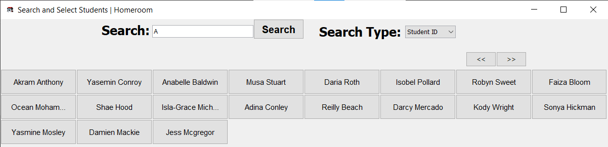

---
hide:
  - footer
title: "🏛️ Form Management"  
---

# Form Management
This page contains a detailed description of ever feature within Form Management that administrative and normal users are able to use.

Homeroom features a powerful Form Management hat is able to handle data at a large, and detailed scale.

???+ info "The Interface for Student Management"

    This menu shows the core functions of Form Management, ranging from viewing form information, adding forms, deleting forms and editing form information.

## View Form
Use the search bar to search for specific forms, making use of several search filters to improve accuracy of your search.

Left-Click your search result form, to view their information. Depending on the level of permissions you hold, you can also delete, or edit the Form's information within this same window.

???+ Check Your Permissions!

    If you are a normal sub-user, you will not be able to edit, or delete Form Information. Ensure you check Homeroom's main menu to see your level of permissions, or ask your administrator.

!!! info " "

    View Form Information from both administrative and normal accounts. Note that editing and deletion of data can only be done through an administrative account.

## Edit Forms
Use Form Management's "View Form" menu to edit Form Information as an administrator.

Left-Click a search result, and edit Form information within the menu with ease. Once you are done editing Form information, simply click one of the "Save" buttons to save your information.

???+ warning "Check your Permissions!"

    If you are a normal sub-user, you will not be able to edit, or delete Form Information. Ensure you check Homeroom's main menu to see your level of permissions, or ask your administrator.

It is worth noting that Form Management behaves somewhat differently, in the sense that most of Form Management is handled with different menus. The usage for these is documented below.

### Add Teacher to Form
You are able to add a specific Teacher to your Form by clicking "Add Teacher". You can then make use of the "Search and Select Teachers" menu to search for a specific Teacher, and have them take over that Form Group.

???+ info "Add your Teacher here!"

    Select your Teacher and add them to your Form!

### Add Student to Form
You are able to add a specific Student to your Form by clicking "Add Student". You can then make use of the "Search and Select Students" menu to search for a specific Student, and have them join that Form Group.

???+ info "Add your Student here!"

    Select your Student and add them to your Form!

## Add Form
Use the Form Management menu to add Form information as an administrator. Make use of the "Add Form" menu to add Form information.

???+ info "Add Your Forms here!"

    Fill in all required fields highlighted in red. Then, click the "Add Form" button to add the Form to Homeroom's database.

!!! warning "Check your Permissions!"

    Only Administrative users are authorised to make use of the "Add Form" button. Only they will be able to both see, and use it.

## Delete Form
Use Form Management's "View Form" menu to delete Form Information as an administrator.

Left-Click a search result, and use the "Delete Form" button to delete Form Information. You will be asked for confirmation before you do this.

!!! warning "Check your Permissions!"

    Only Administrative users are authorised to make use of the "Delete Form" button. Only they will be able to both see, and use it.

???+ danger "Careful!"

    Ensure that you delete the right Form Groups. You will NOT be able to recover any data you delete!