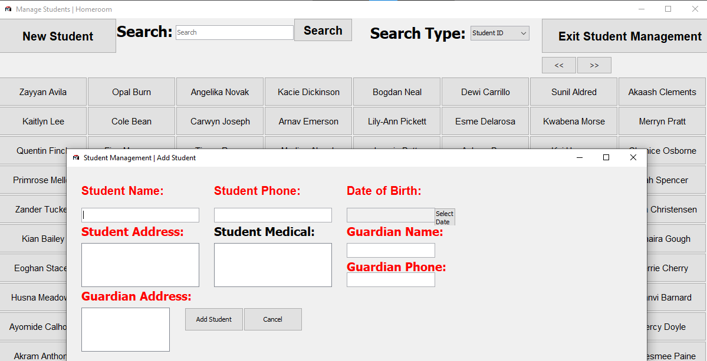

---
hide:
  - footer
title: "👨‍🎓 Student Management"  
---

# Student Management
This page contains a detailed description of every feature within Student Management that administrative and normal sub-users are able to use.

Homeroom features a powerful Student Management system that is able to handle data at a large, and detailed scale. 

???+ info "The Interface for Student Management"

    This menu shows the core functions of Student Management, ranging from viewing student information, adding students, deleting students and editing student information. 

## View Student
Use the search bar to search for specific students, making use of several search filters to improve the accuracy of your search. 

Left-Click your search result student, to view their information. Depending on the level of permissions you hold, you can also delete, or edit the Student's information within this same window. 

???+ warning "Check your permissions!"

    If you are a normal sub-user, you will not be able to edit, or delete Student information. Ensure you check Homeroom's main menu to see your level of permissions, or ask your administrator.

!!! info "Information"

    View Student information from both administrative and normal accounts. Note that editing and deletion of data can only be done through an administrative account.

## Edit Student
Use Student Management's "View Student" menu to edit Student Information as an administrator. 

Left-Click a search result, and edit Student information within the menu with ease. Once you are done editing Student information, simply click one of the "Save" buttons to save your information.

???+ warning "Check your Permissions!"

    If you are a normal sub-user, you will not be able to edit, or delete Student information. Ensure you check Homeroom's main menu to see your level of permissions, or ask your administrator.

## Add Student
Use the Student Management menu to add Student Information as an administrator. Make use of the "Add Student" menu to add student information.

!!! warning "Check your Permissions!"

    Only Adminsitrative users are authorised to make use of the "Add Student" button. Only they will be able to use it. Should a standard sub-user make use of this button, you will see the following error.

???+ info "Add Your Students here!"

    Fill in all required fields highlighted in red, and any black, optional fields. Then, click the "Add Student" button to add the Student to Homeroom's database.

## Delete Student
Use Student Management's "View Student" menu to delete Student Information as an administrator.

Left-Click a search result, and use the "Delete Student" button to delete Student Information. You will be asked for confirmation before you do this.

!!! warning "Check your Permissions!"

    Only Administratrative users are authorised to make use of the "Delete Student" button. Only they will be able to both see, and use it.

???+ danger "Careful!"

    Ensure that you delete the right Students. You will NOT be able to recover any data you delete!