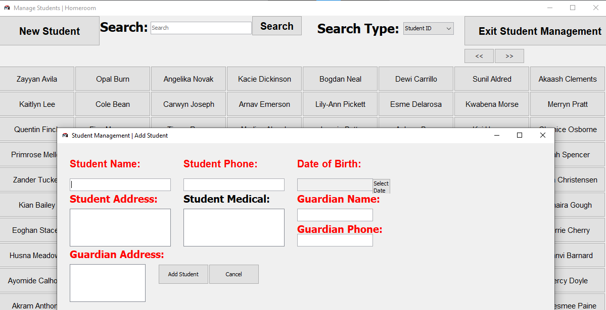
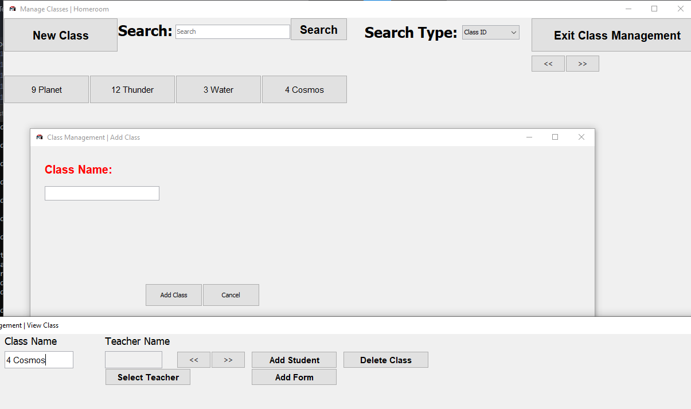
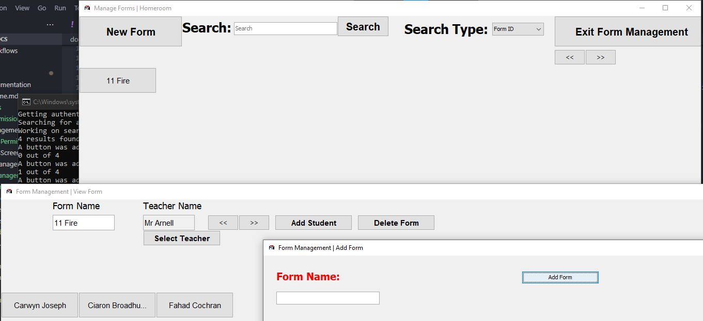

---
hide:
  - footer
title: "📚 Reference"  
---

# User Documentation Reference
This page contains a minor overview over every feature within Homeroom that administrative users and normal sub-users are able to use. This page should be looked over at least once before using Homeroom, to ensure that users are familiar with what they will see when beginning to work with Homeroom.

## [Student Management](studentManagement.md)
Student Management is used to create, view, delete and edit Student information. These Students can then be used throughout the application and your institution.

For example, they could be added to a Class and a Form, and be added to assembly periods and lessons throughout the day.

!!! info "Student Management"

    View, Edit, Add and Delete Students from this menu. Any new information added to this menu should be refreshed when initiating another search.

[Go to Student Management :student:](studentManagement.md){.md-button .md-button--primary}

## [Class Management](classManagement.md)
Class Management is used to create, view, delete and edit Class information. These Classes can then be used throughout the application and your institution.

For example, you can add Students and Teachers to a Class, to have a lesson be taught to them. Alternatively, you could assemble multiple Classes together in an assembly, using these Classes.

!!! info "Class Management"

    View, Edit, Add and Delete Classes from this menu. Any new information added to this menu should be refreshed when initiating another search.

[Go to Class Management :simple-googleclassroom:](classManagement.md){.md-button .md-button--primary}

## [Form Management](formManagement.md)
Form Management is used to create, view, delete and edit Form information. These Forms can then be used throughout the application and your institution.

For example, you can add Students and Teachers to a Form, for form group periods in the morning. Additionally, you could also use these Form Groups to gather an entire Year Group into an assembly period. 

!!! info "Form Management"

    View, Edit, Add and Delete Forms from this menu. Any new information added to this menu should be refreshed when initiating another search.

[Go to Form Management :homes:](formManagement.md){.md-button .md-button--primary}